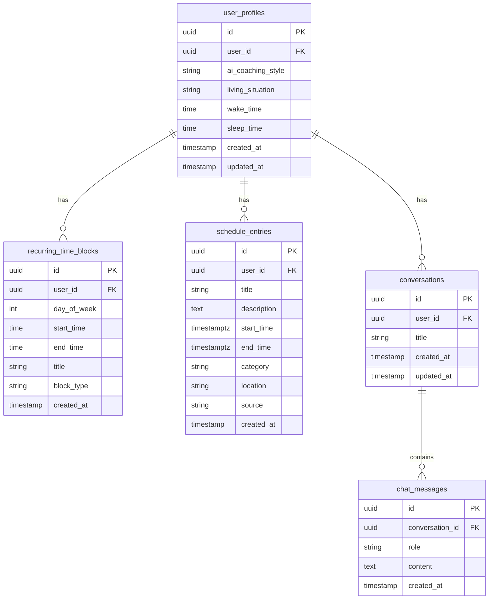

# FocusFlow - Product Requirements Document

**Version:** 1.0.0  
**Last Updated:** October 20, 2025  
**Status:** MVP Complete

---

## Executive Summary

**FocusFlow** is an AI-powered productivity and time management application designed for college students, working professionals, and anyone managing complex schedules with variable commitments. Unlike traditional productivity tools that treat all time as equal, FocusFlow recognizes that people have fixed obligations (work, classes) alongside flexible tasks, and provides intelligent, context-aware assistance to optimize their day.

### Core Value Proposition

- **AI Coach That Knows Your Life**: Personalized productivity coaching that adapts to your schedule, energy levels, and living situation
- **Schedule-Aware Planning**: Import class schedules and work shifts, then get task recommendations that fit around your fixed commitments
- **Effortless Organization**: Upload PDFs of your schedule and let AI parse them automatically
- **Flexible Yet Structured**: Balance between planned time blocks and spontaneous productivity

### Target Users

1. **College Students** (Primary)
   - Managing classes, homework deadlines, work shifts
   - Variable schedules that change semester-to-semester
   - Need to import Canvas LMS schedules

2. **Working Professionals** (Secondary)
   - Juggling meetings, projects, personal tasks
   - Recurring weekly schedules with one-off events
   - Looking for AI-powered task prioritization

3. **Hybrid Workers** (Tertiary)
   - Part-time students + part-time workers
   - Multiple recurring schedules to balance
   - Need intelligent scheduling around constraints

---

## System Architecture

### Technology Stack

**Frontend:**
- React 18.3+ with TypeScript
- Vite build system
- Tailwind CSS + shadcn/ui components
- React Query for data fetching
- React Router for navigation

**Backend (Lovable Cloud):**
- Supabase PostgreSQL database
- Row Level Security (RLS) policies
- Edge Functions (Deno runtime)
- Lovable AI integration (Gemini 2.5 Flash)

**Authentication:**
- Supabase Auth with email/password
- Auto-confirm email signups (development)
- JWT-based session management

### Database Schema



### Core Data Entities

#### 1. **User Profile** (`user_profiles`)
Extended user information beyond auth credentials.

**Fields:**
- `ai_coaching_style`: "supportive" | "direct" | "analytical"
- `living_situation`: Free text (e.g., "dorm", "apartment", "with parents")
- `wake_time`: Typical wake time (HH:MM)
- `sleep_time`: Typical sleep time (HH:MM)

**Purpose:** Personalizes AI responses and task scheduling recommendations.

#### 2. **Recurring Time Blocks** (`recurring_time_blocks`)
Weekly repeating schedule entries (work shifts, classes).

**Fields:**
- `day_of_week`: 0-6 (Sunday-Saturday)
- `start_time`, `end_time`: Time of day
- `title`: Display name (e.g., "Work", "CS101")
- `block_type`: "work" | "class" | custom

**Purpose:** Represents fixed commitments that tasks must schedule around.

#### 3. **Schedule Entries** (`schedule_entries`)
One-time events (homework deadlines, meetings, variable shifts).

**Fields:**
- `start_time`, `end_time`: Full ISO 8601 datetime
- `category`: "work" | "class" | "homework" | "meeting" | "other"
- `source`: "manual" | "pdf_upload"
- `location`: Physical or virtual location

**Purpose:** Represents non-recurring obligations and deadlines.

#### 4. **Tasks** (localStorage: `focusflow-tasks`)
User's to-do items, can be scheduled or unscheduled.

**Fields:**
- `scheduledDate`, `scheduledTime`: When task is planned
- `duration`: Expected minutes to complete
- `priority`: "low" | "medium" | "high"
- `energy`: Energy level required
- `eisenhowerQuadrant`: Urgency/importance classification

**Purpose:** User's actual work items to be organized around schedule.

#### 5. **Conversations & Messages** (`conversations`, `chat_messages`)
AI assistant chat history.

**Purpose:** Persistent AI coaching conversations that maintain context across sessions.

---

## Feature Specifications

### 1. AI Assistant System

**Location:** Sidebar component (`AIAssistant.tsx`)

#### Personality Modes

1. **Supportive Coach**
   - Encouraging, empathetic tone
   - Focuses on small wins and progress
   - Gentle accountability

2. **Direct Advisor**
   - No-nonsense, action-oriented
   - Concise recommendations
   - Firm accountability

3. **Analytical Strategist**
   - Data-driven insights
   - System optimization focus
   - Logical reasoning

#### Context Awareness

The AI receives:
- **User Profile**: Coaching style, living situation, sleep/wake times
- **Upcoming Schedule**: Next 14 days of schedule_entries
- **Recent Tasks**: User's task list with priorities

AI uses this to:
- Suggest task timing based on free time slots
- Adapt language to coaching preference
- Consider living situation (e.g., "quiet time in dorm" vs "home office")

#### Technical Implementation

**Edge Function:** `ai-assistant`
- Model: `google/gemini-2.5-flash` (via Lovable AI Gateway)
- Streaming response via Server-Sent Events
- No API key required (uses Lovable AI)

**System Prompt Pattern:**
```
You are a ${coachingStyle} productivity coach.

USER CONTEXT:
- Living situation: ${livingSituation}
- Daily rhythm: Awake ${wakeTime}-${sleepTime}
- Upcoming commitments: [list of schedule entries]

Provide actionable advice considering their schedule constraints.
```

#### Conversation Persistence

- All messages saved to `chat_messages` table
- Conversations grouped by `conversation_id`
- Most recent conversation auto-loads on open
- `updated_at` timestamp refreshed on new messages

---

### 2. Schedule Management System

**Location:** Settings page > Schedule Manager (`ScheduleManager.tsx`)

#### 2A. Recurring Schedule (Profile Setup)

**First-Run Experience:** `ProfileSetupDialog.tsx`

**Step 1:** Choose AI coaching style  
**Step 2:** Living situation + Work schedule  
**Step 3:** Daily rhythm (wake/sleep times)

**Work Schedule Input:**
- Checkbox for each day of week
- Time pickers for start/end
- Saved to `recurring_time_blocks` table

**Example Use Case:**
> Student works retail: Mon/Wed/Fri 4pm-9pm
> → Creates 3 recurring blocks in database
> → AI knows to never suggest tasks during those times

#### 2B. Variable Schedule (Schedule Manager)

**Upload PDF:**
1. User selects PDF file (Canvas export, work schedule, etc.)
2. File sent to `parse-schedule` edge function
3. AI vision (gemini-2.5-flash) extracts events:
   - Classes with start/end times
   - Homework deadlines (assumes 11:59 PM if no time)
   - Meetings
   - Variable shifts
4. Results inserted into `schedule_entries` table

**Manual Entry:**
- Form fields: Title, Description, Start Date/Time, End Date/Time, Category, Location
- Direct insert into `schedule_entries`

**PDF Parsing Technical Details:**

**Edge Function:** `parse-schedule`
- **Authentication:** Required (`verify_jwt = true`)
- **Input:** FormData with PDF file
- **Model:** `google/gemini-2.5-flash` (vision-capable)
- **Output:** JSON array of schedule entries

**AI Prompt Strategy:**
```
Extract all work shifts, classes, meetings, and homework deadlines.
Return JSON array with:
- title, description, startTime (ISO 8601), endTime, category, location

Rules:
- Parse dates relative to current date if year not specified
- Homework deadlines: assume 11:59 PM if no time given
- Classes: extract exact start/end times
- Category: "work" | "class" | "homework" | "meeting" | "other"
```

**Known Issue (FIXED in v1.0.1):**
- **Bug:** Large PDFs caused "Maximum call stack size exceeded" error
- **Cause:** Inefficient base64 conversion using spread operator
- **Fix:** Chunk-based conversion (8192 byte chunks)
- **Status:** ✅ Resolved

---

### 3. Task Management

**Location:** Main dashboard components

#### Task States

1. **Unscheduled Tasks** (`UnscheduledTaskItem.tsx`)
   - In task inbox, no scheduledDate
   - Can be dragged to calendar
   - AI can suggest scheduling

2. **Scheduled Tasks** (`ScheduledTaskCard.tsx`)
   - Has scheduledDate and optionally scheduledTime
   - Appears in calendar view and timeline
   - Duration-aware (blocks time on calendar)

3. **Completed Tasks**
   - `completed: true`
   - Strikethrough styling
   - Can be filtered out of views

#### Task Organization Views

**Eisenhower Matrix** (`EisenhowerMatrix.tsx`):
- 2x2 grid: Urgent/Not Urgent × Important/Not Important
- Drag-and-drop to classify tasks
- Helps prioritize what to work on

**Energy-Based Widget** (`EnergyTaskWidget.tsx`):
- Groups tasks by energy requirement
- Matches tasks to user's current energy level
- Useful for choosing tasks throughout day

**Daily Flow Timeline** (`DailyFlowTimeline.tsx`):
- Visual timeline of day's scheduled items
- Shows time blocks + scheduled tasks
- Gaps represent free time for new tasks

#### AI Task Organization

**Edge Function:** `organize-tasks`
- Takes unscheduled tasks + user schedule
- Returns suggested scheduledDate/scheduledTime
- Considers: Priority, duration, energy, free time slots

---

### 4. Time Tracking & Focus Tools

**Location:** Timer Hub (`TimerHub.tsx`)

#### Available Timer Types

1. **Pomodoro Timer** (`FocusTimer.tsx`)
   - Classic 25min work / 5min break
   - Tracks completed pomodoros per task

2. **Flowtime Tracker** (`FlowtimeTracker.tsx`)
   - Flexible work periods
   - Records actual work time
   - Good for deep work sessions

3. **Interval Timer** (`IntervalTimer.tsx`)
   - Custom work/break intervals
   - Useful for HIIT-style productivity

4. **Task Sequencer** (`TaskSequencer.tsx`)
   - Queue multiple tasks
   - Auto-advance to next task
   - Good for batch processing

5. **Time Chime** (`TimeChime.tsx`)
   - Hourly awareness reminders
   - Helps maintain time consciousness

6. **Todo Tomatoes** (`TodoTomatoes.tsx`)
   - Pomodoro + Task list integration
   - Estimates pomodoros needed per task

---

### 5. Playbooks (Workflow Templates)

**Location:** Playbooks tab (`PlaybooksTab.tsx`)

**What is a Playbook?**
- Pre-defined sequence of steps
- Each step has: Title, Duration, Description
- Categories: Morning, Work, Study, Evening, Custom

**Built-in Templates:**
- Morning Routine
- Deep Work Session
- Study Sprint
- Evening Wind-Down

**AI Playbook Generation:**

**Edge Function:** `generate-playbook`
- Input: Natural language prompt (e.g., "Help me prepare for a final exam")
- Output: Custom playbook with steps and timing
- Model: gemini-2.5-flash

**Use Case:**
> User: "I need a workflow for writing a research paper"
> AI generates: Research (45min) → Outline (30min) → Draft (90min) → Break (15min) → Edit (60min)

---

### 6. Dashboard Widgets

**Location:** Widget Panel (`WidgetPanel.tsx`)

#### Available Widgets

1. **Today's Priorities** (`TodaysPriorities.tsx`)
   - Top 3 tasks for today
   - Quick complete checkboxes

2. **Mood Garden** (`MoodGardenWidget.tsx`)
   - Daily mood tracking
   - Visual garden metaphor

3. **Future Self Messenger** (`FutureSelfMessengerWidget.tsx`)
   - Leave messages for future you
   - Delivered on specific dates

4. **Parallel Universe** (`ParallelUniverseWidget.tsx`)
   - Hypothetical alternative schedules
   - "What if I worked on X instead?"

5. **Sound Signature** (`SoundSignatureWidget.tsx`)
   - Quick access to focus playlists/sounds

6. **Reminders** (`ReminderWidgetDisplay.tsx`)
   - Simple reminder notifications

#### Widget Customization

- Each widget has an editor component
- User can show/hide widgets
- Position can be reordered (drag-and-drop)
- Config saved to localStorage

---

### 7. Premium Features

**Location:** `PremiumContext.tsx`, pricing page

#### Free Tier Limits

- Max 3 projects
- Max 50 tasks
- Max 20 time blocks per week
- Max 5 playbooks

#### Premium Benefits (Stripe Integration)

- Unlimited projects, tasks, time blocks
- Unlimited playbooks
- Priority AI response time
- Advanced analytics (roadmap)
- Sync across devices (roadmap)

**Implementation:**
- Stripe Checkout for subscriptions
- Customer Portal for management
- Edge functions: `create-checkout`, `check-subscription`, `customer-portal`

---

### 8. Authentication Flow

**Public Routes:**
- `/landing` - Marketing page
- `/pricing` - Subscription plans
- `/auth` - Login/signup

**Protected Routes:**
- `/` - Main dashboard (requires auth)
- `/settings` - User settings

**Auth Implementation:**
- Supabase Auth with email/password
- `RequireAuth` component wrapper
- `PublicOnly` component for auth pages
- Auto-confirm emails enabled (dev mode)

**Security:**
- Row Level Security (RLS) on all user tables
- Policies enforce `auth.uid() = user_id`
- JWT verification on sensitive edge functions

---

## User Flows

### Primary Flow: New User Onboarding

1. **Landing Page** → Click "Get Started"
2. **Sign Up** → Enter email/password → Auto-confirmed
3. **Profile Setup Dialog** (automatic):
   - Step 1: Choose coaching style
   - Step 2: Living situation + work days/hours
   - Step 3: Wake/sleep times
4. **Dashboard** loads with:
   - AI Assistant sidebar (welcomes user)
   - Empty task list
   - Calendar with recurring work blocks
5. **Settings** → Schedule Manager:
   - Upload class schedule PDF
   - AI parses and adds to calendar
6. **Add First Task** → Task appears in inbox
7. **Ask AI**: "When should I work on this?"
   - AI suggests time slot based on schedule
8. **Schedule Task** → Appears in calendar

### Secondary Flow: Daily Planning

1. User opens app in morning
2. AI Assistant proactively asks: "What's your priority today?"
3. User adds 2-3 tasks
4. AI suggests: "You have free time at 2pm-4pm, good for [High Priority Task]"
5. User drags task to calendar at that time
6. Starts Pomodoro timer
7. Completes task, marks done
8. AI celebrates: "Great work! That's your second task today 🎉"

### Tertiary Flow: Weekly Schedule Update

1. User gets new work schedule for next week
2. Goes to Settings → Schedule Manager
3. Clicks "Upload Schedule PDF"
4. Selects file → AI processes
5. Preview shows parsed entries
6. User confirms → Schedule updated
7. Returns to dashboard
8. Calendar now shows next week's shifts
9. AI automatically adjusts task suggestions

---

## Technical Specifications

### Edge Functions Reference

| Function | Auth | Method | Purpose | Model |
|----------|------|--------|---------|-------|
| `ai-assistant` | Optional | POST | AI coaching chat | gemini-2.5-flash |
| `parse-schedule` | Required | POST | Extract schedule from PDF | gemini-2.5-flash (vision) |
| `organize-tasks` | Optional | POST | AI task scheduling | gemini-2.5-flash |
| `generate-playbook` | Optional | POST | AI workflow generation | gemini-2.5-flash |
| `create-checkout` | Required | POST | Stripe checkout session | N/A |
| `check-subscription` | Required | POST | Verify premium status | N/A |
| `customer-portal` | Required | POST | Stripe billing portal | N/A |

### Lovable AI Integration

**Why Lovable AI?**
- No API key required from users
- Seamless integration with Lovable Cloud
- Access to latest Gemini models
- Handles rate limiting and quotas

**API Endpoint:**
```
https://ai.gateway.lovable.dev/v1/chat/completions
```

**Supported Models:**
- `google/gemini-2.5-pro` - Most capable, slower
- `google/gemini-2.5-flash` - Balanced (used in FocusFlow)
- `google/gemini-2.5-flash-lite` - Fastest, simpler tasks
- `openai/gpt-5`, `gpt-5-mini`, `gpt-5-nano` - Available alternatives

**Request Format:**
```json
{
  "model": "google/gemini-2.5-flash",
  "messages": [
    {"role": "system", "content": "You are a productivity coach..."},
    {"role": "user", "content": "How should I prioritize my tasks?"}
  ],
  "max_tokens": 2000
}
```

**Streaming Response:**
```javascript
const response = await fetch('https://ai.gateway.lovable.dev/v1/chat/completions', {
  headers: {
    'Authorization': `Bearer ${LOVABLE_API_KEY}`,
    'Content-Type': 'application/json',
  },
  body: JSON.stringify({...})
});

// Server-Sent Events stream
const reader = response.body.getReader();
const decoder = new TextDecoder();
while (true) {
  const {done, value} = await reader.read();
  if (done) break;
  const chunk = decoder.decode(value);
  // Process chunk...
}
```

### LocalStorage Schema

**Rationale:** Core user data (tasks, projects, widgets) stored client-side for instant UI updates. Backend sync planned for premium tier.

**Keys:**
- `focusflow-tasks` - Array<Task>
- `focusflow-projects` - Array<Project>
- `focusflow-timeBlocks` - Array<TimeBlock>
- `focusflow-widgets` - Array<Widget>
- `focusflow-playbooks` - Array<Playbook>
- `focusflow-theme` - "light" | "dark" | "system"
- `focusflow-onboarding-completed` - boolean

**Data Sync Service** (`syncService.ts`):
- Planned: Sync localStorage to Supabase `user_data` table
- Premium feature for multi-device access
- Currently: localStorage only

---

## Design System

### Theme Configuration

**File:** `src/index.css`

**Color Tokens (HSL):**
```css
:root {
  --background: 0 0% 100%;
  --foreground: 222.2 84% 4.9%;
  --primary: 221.2 83.2% 53.3%;
  --secondary: 210 40% 96.1%;
  --accent: 210 40% 96.1%;
  --destructive: 0 84.2% 60.2%;
  /* ... more tokens ... */
}

.dark {
  --background: 222.2 84% 4.9%;
  --foreground: 210 40% 98%;
  /* ... dark mode variants ... */
}
```

**Typography:**
- Font: Inter (system fallback: sans-serif)
- Headings: Bold, tight tracking
- Body: Regular, readable line-height

**Component Library:**
- shadcn/ui (Radix UI primitives + Tailwind)
- Custom variants via `class-variance-authority`
- Design tokens via CSS variables

---

## Known Issues & Limitations

### Current Limitations

1. **PDF Parsing:**
   - ✅ Fixed: Large file stack overflow (v1.0.1)
   - Only supports PDF format (no DOCX, images)
   - Max 50 pages parsed (Lovable AI limit)
   - Accuracy depends on PDF structure

2. **Data Sync:**
   - LocalStorage-only (no multi-device sync yet)
   - No offline support
   - Risk of data loss if localStorage cleared

3. **AI Assistant:**
   - No conversation editing/deletion UI
   - Limited to text (no file uploads to chat)
   - No conversation search

4. **Schedule Conflicts:**
   - No automatic detection of overlapping events
   - User must manually resolve conflicts

5. **Mobile:**
   - Responsive design present but not optimized
   - Calendar drag-and-drop difficult on mobile
   - No native mobile app

### Planned Improvements (Roadmap)

**v1.1.0 - Enhanced Scheduling**
- [ ] Conflict detection and warnings
- [ ] Bulk schedule entry editing
- [ ] Import from Google Calendar / Outlook
- [ ] Recurring schedule exceptions

**v1.2.0 - Better AI**
- [ ] Multi-turn conversation management UI
- [ ] Conversation search and archive
- [ ] Voice input for AI chat
- [ ] Image uploads to AI (e.g., whiteboard photos)

**v1.3.0 - Data Sync (Premium)**
- [ ] Sync localStorage to Supabase `user_data` table
- [ ] Multi-device support
- [ ] Offline mode with sync queue
- [ ] Backup/export user data

**v2.0.0 - Mobile First**
- [ ] Mobile-optimized UI
- [ ] Touch-friendly calendar
- [ ] Native mobile app (React Native)
- [ ] Push notifications for reminders

---

## Success Metrics (KPIs)

### User Engagement
- **Daily Active Users (DAU)** - Target: 40% of MAU
- **Tasks Created per User** - Target: 5+/week
- **AI Messages Sent** - Target: 3+/day
- **Schedule Entries Added** - Target: 10+/month

### Feature Adoption
- **Profile Setup Completion** - Target: 80%+
- **PDF Schedule Upload** - Target: 30% of users
- **Playbook Usage** - Target: 50% try at least one
- **Timer Usage** - Target: 60% start at least one session

### Premium Conversion
- **Free to Premium** - Target: 5% conversion
- **Churn Rate** - Target: <10%/month
- **ARPU (Average Revenue Per User)** - Target: $5/month

### AI Quality
- **AI Response Satisfaction** - Survey: 4+/5 stars
- **AI Suggestion Acceptance** - Target: 40% of suggestions acted upon
- **Schedule Parse Accuracy** - Target: 90%+ for standard PDFs

---

## Appendix

### File Structure

```
src/
├── components/
│   ├── AIAssistant.tsx              # AI chat sidebar
│   ├── ScheduleManager.tsx          # PDF upload + manual entry
│   ├── ProfileSetupDialog.tsx       # Onboarding wizard
│   ├── TaskList.tsx                 # Main task management
│   ├── CalendarScheduler.tsx        # Drag-and-drop calendar
│   ├── EisenhowerMatrix.tsx         # Task prioritization
│   ├── TimerHub.tsx                 # Focus timer collection
│   ├── PlaybooksTab.tsx             # Workflow templates
│   ├── WidgetPanel.tsx              # Dashboard widgets
│   └── ... (more components)
├── contexts/
│   ├── AuthContext.tsx              # Supabase auth state
│   └── PremiumContext.tsx           # Subscription status
├── hooks/
│   ├── useSyncedStorage.ts          # localStorage + Supabase sync
│   ├── useFeatureLimit.ts           # Free tier enforcement
│   └── useTimerState.ts             # Timer state management
├── pages/
│   ├── Landing.tsx                  # Public homepage
│   ├── Index.tsx                    # Main dashboard
│   ├── Settings.tsx                 # User settings + schedule
│   └── Auth.tsx                     # Login/signup
├── integrations/supabase/
│   ├── client.ts                    # Supabase client (auto-generated)
│   └── types.ts                     # Database types (auto-generated)
└── services/
    └── syncService.ts               # Data sync logic

supabase/
├── functions/
│   ├── ai-assistant/index.ts        # AI chat endpoint
│   ├── parse-schedule/index.ts      # PDF parsing
│   ├── organize-tasks/index.ts      # AI task scheduling
│   ├── generate-playbook/index.ts   # AI workflow generation
│   ├── create-checkout/index.ts     # Stripe payment
│   ├── check-subscription/index.ts  # Premium verification
│   └── customer-portal/index.ts     # Billing portal
└── config.toml                      # Edge function config

docs/
├── PRD.md                           # This document
└── schema.json                      # Complete data model
```

### Dependencies

**Core:**
- `react@18.3.1`, `react-dom@18.3.1`
- `@tanstack/react-query@5.83.0` - Data fetching
- `@supabase/supabase-js@2.75.0` - Backend client

**UI:**
- `tailwindcss` + `tailwindcss-animate`
- `@radix-ui/*` - Unstyled UI primitives (30+ packages)
- `lucide-react@0.462.0` - Icons
- `sonner@1.7.4` - Toast notifications

**Forms:**
- `react-hook-form@7.61.1`
- `zod@3.25.76` - Schema validation
- `@hookform/resolvers@3.10.0`

**Utilities:**
- `date-fns@4.1.0` - Date manipulation
- `clsx` + `tailwind-merge` - Conditional classes

**Routing:**
- `react-router-dom@6.30.1`

---

## Conclusion

FocusFlow aims to be the **first productivity app that truly understands your constraints**. By combining AI coaching with schedule-aware task management, it helps users make realistic plans that actually fit their lives.

**Key Differentiators:**
1. Import schedules via PDF (no manual data entry)
2. AI that knows your fixed commitments
3. Personalized coaching styles
4. Balance between structure and flexibility

**Next Steps:**
- Improve PDF parsing accuracy
- Add conflict detection
- Implement multi-device sync
- Mobile app development

For technical questions or feature requests, contact: [support@focusflow.app](mailto:support@focusflow.app)

---

**Document History:**

| Version | Date | Changes |
|---------|------|---------|
| 1.0.0 | Oct 20, 2025 | Initial PRD creation |
| 1.0.1 | Oct 20, 2025 | Added PDF parsing bug fix documentation |
